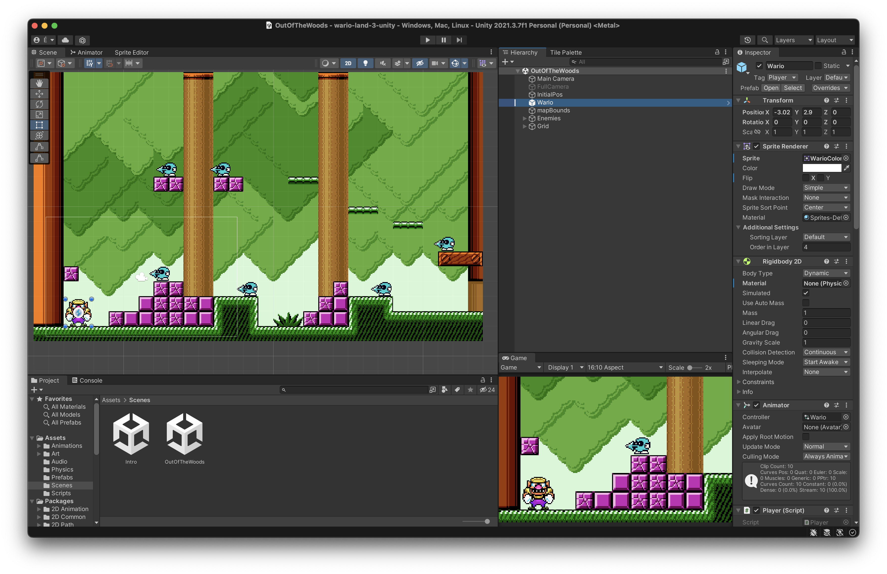

# Wario Land with Unity

I created this project inspirated in
Wario Land 3 sprites with learn propose.

-----

Check WebGL Build [https://hewerthomn.com/wario-land-3-unity/](https://hewerthomn.com/wario-land-3-unity/)

------

------

Sprites from https://www.spriters-resource.com/game_boy_gbc/warioland3/

Out of the Woods HD Remix
https://www.youtube.com/watch?v=Xr2iAVlPHBY